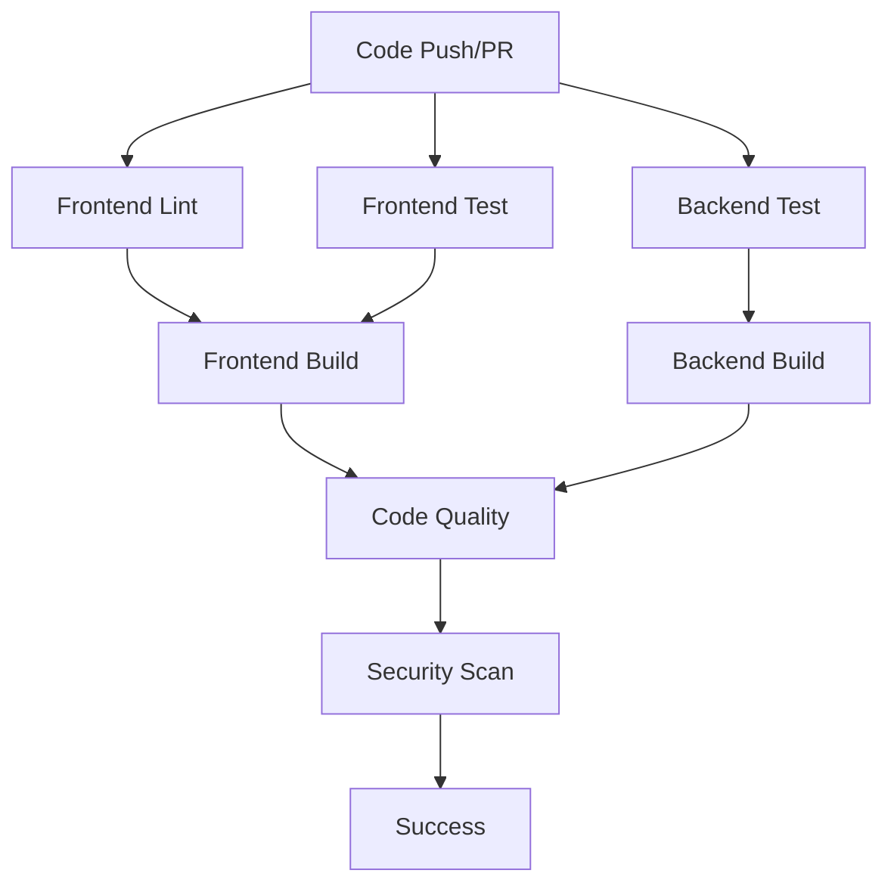
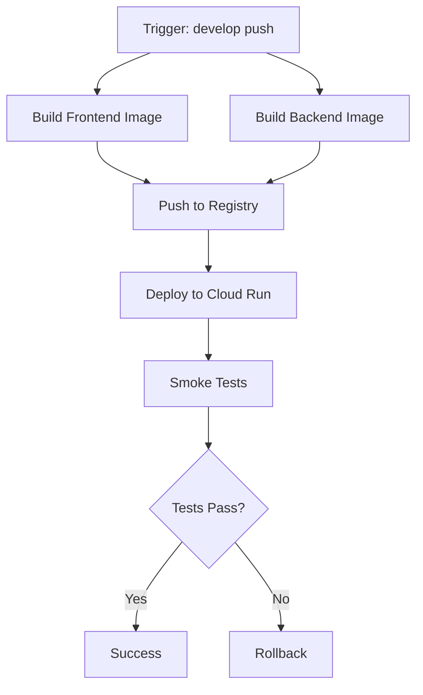
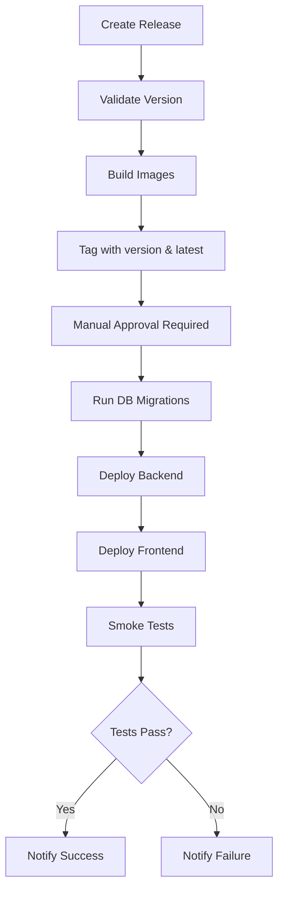

# GitHub Actions Pipeline-as-a-Service

This directory contains comprehensive CI/CD workflows for the Perundhu Bus Tracker application.

## 📋 Table of Contents

- [Workflows Overview](#workflows-overview)
- [Setup Instructions](#setup-instructions)
- [Secrets Configuration](#secrets-configuration)
- [Usage Guide](#usage-guide)
- [Workflow Details](#workflow-details)
- [Best Practices](#best-practices)

## 🔄 Workflows Overview

### 1. **CI Pipeline** (`ci.yml`)
**Trigger**: Push to main/develop, Pull Requests  
**Purpose**: Continuous Integration - Build, test, and validate code quality

**Jobs**:
- ✅ Frontend linting and type checking
- ✅ Frontend unit tests
- ✅ Frontend build
- ✅ Backend tests (with MySQL service)
- ✅ Backend build
- ✅ Code quality analysis
- ✅ Security scanning with Trivy

### 2. **E2E Tests** (`e2e-tests.yml`)
**Trigger**: Push to main/develop/master, Pull Requests  
**Purpose**: End-to-end testing with Playwright

**Jobs**:
- 🌐 Desktop browser tests (Chromium, Firefox, WebKit)
- 📱 Mobile browser tests (Chrome, Safari)
- 📊 Test report generation and artifact upload

### 3. **CD Staging** (`cd-staging.yml`)
**Trigger**: Push to develop branch, Manual dispatch  
**Purpose**: Deploy to staging environment

**Jobs**:
- 🐳 Build and push Docker images to GCP Artifact Registry
- 🚀 Deploy to Cloud Run (staging)
- 🧪 Run smoke tests

### 4. **CD Production** (`cd-production.yml`)
**Trigger**: Release published, Manual dispatch with version  
**Purpose**: Deploy to production environment

**Jobs**:
- ✔️ Validate release version
- 🐳 Build and tag production images
- 📦 Run database migrations
- 🚀 Deploy to Cloud Run (production)
- 🧪 Production smoke tests
- 📢 Deployment notifications

### 5. **Dependency Update** (`dependency-update.yml`)
**Trigger**: Weekly schedule (Mondays 9 AM UTC), Manual dispatch  
**Purpose**: Automated dependency updates

**Jobs**:
- 📦 Update frontend npm packages
- 📦 Update backend Gradle dependencies
- 🔒 Security audit
- 🔀 Automatic PR creation

### 6. **Docker Build** (`docker-build.yml`)
**Trigger**: Push to main/develop, PR, Manual dispatch  
**Purpose**: Build and publish Docker images

**Jobs**:
- 🏗️ Build multi-architecture images (amd64, arm64)
- 📦 Push to GitHub Container Registry
- 🔍 Vulnerability scanning

### 7. **Database Migration** (`database-migration.yml`)
**Trigger**: Manual dispatch only  
**Purpose**: Manage database schema migrations

**Jobs**:
- 🗄️ Run Flyway migrations
- ✅ Validate migrations
- 🔧 Repair migration state
- 💾 Automatic backups (production)

## 🚀 Setup Instructions

### 1. Enable GitHub Actions

Actions are enabled by default. Verify in: `Settings > Actions > General`

### 2. Configure Environments

Create the following environments in `Settings > Environments`:

- **staging**: For staging deployments
- **preprod**: For pre-production testing
- **production**: For production deployments (add protection rules)

#### Production Environment Protection Rules:
- ✅ Required reviewers (at least 2)
- ✅ Wait timer (5-10 minutes)
- ✅ Limit to main branch only

### 3. Create Workflow Permissions

Go to `Settings > Actions > General > Workflow permissions`:
- Select: "Read and write permissions"
- Check: "Allow GitHub Actions to create and approve pull requests"

## 🔐 Secrets Configuration

### Required Secrets

Add these in `Settings > Secrets and variables > Actions`:

#### Google Cloud Platform
```
GCP_PROJECT_ID          # astute-strategy-406601
GCP_SA_KEY             # Service account JSON key (base64 encoded)
```

#### Database Credentials

**Staging:**
```
STAGING_DB_URL         # jdbc:mysql://host:port/database
STAGING_DB_USER        # Database username
STAGING_DB_PASSWORD    # Database password
```

**Production:**
```
PROD_DB_URL           # jdbc:mysql://host:port/database
PROD_DB_USER          # Database username
PROD_DB_PASSWORD      # Database password
```

#### Optional
```
SLACK_WEBHOOK_URL     # For deployment notifications
SONAR_TOKEN          # For SonarCloud analysis
```

### Setting up GCP Service Account

```bash
# Create service account
gcloud iam service-accounts create github-actions \
  --display-name="GitHub Actions"

# Grant necessary roles
gcloud projects add-iam-policy-binding astute-strategy-406601 \
  --member="serviceAccount:github-actions@astute-strategy-406601.iam.gserviceaccount.com" \
  --role="roles/run.admin"

gcloud projects add-iam-policy-binding astute-strategy-406601 \
  --member="serviceAccount:github-actions@astute-strategy-406601.iam.gserviceaccount.com" \
  --role="roles/storage.admin"

gcloud projects add-iam-policy-binding astute-strategy-406601 \
  --member="serviceAccount:github-actions@astute-strategy-406601.iam.gserviceaccount.com" \
  --role="roles/artifactregistry.admin"

# Create and download key
gcloud iam service-accounts keys create key.json \
  --iam-account=github-actions@astute-strategy-406601.iam.gserviceaccount.com

# The content of key.json should be added as GCP_SA_KEY secret
```

## 📖 Usage Guide

### Running Workflows Manually

#### Deploy to Staging
```
Actions > CD - Deploy to Staging > Run workflow
  - Branch: develop
  - Environment: staging
```

#### Deploy to Production
```
Actions > CD - Deploy to Production > Run workflow
  - Version: v1.0.0 (must match release tag)
```

#### Database Migration
```
Actions > Database Migration > Run workflow
  - Environment: staging/preprod/production
  - Action: migrate/validate/info/repair
  - Dry run: true/false
```

### Creating a Release

1. **Create a version tag:**
   ```bash
   git tag -a v1.0.0 -m "Release version 1.0.0"
   git push origin v1.0.0
   ```

2. **Create GitHub Release:**
   - Go to `Releases > Create a new release`
   - Choose tag: `v1.0.0`
   - Generate release notes
   - Publish release

3. **Production deployment automatically triggers**

### Viewing Workflow Results

- **Actions tab**: View all workflow runs
- **Pull Requests**: See check status
- **Deployments**: Track environment deployments
- **Security tab**: View vulnerability reports

## 📊 Workflow Details

### CI Pipeline Flow



### CD Pipeline Flow



### Production Deployment Flow



## 🎯 Best Practices

### 1. Branch Strategy

- **main/master**: Production-ready code
- **develop**: Integration branch for features
- **feature/***: Individual features
- **hotfix/***: Emergency production fixes

### 2. Deployment Strategy

- **Staging**: Auto-deploy from develop
- **Production**: Manual release with approval
- **Rollback**: Use previous release tag

### 3. Database Migrations

- Always run with `dry_run: true` first
- Test in staging before production
- Create backup before production migration
- Use repair only when necessary

### 4. Secrets Management

- Rotate secrets regularly
- Use environment-specific secrets
- Never commit secrets to code
- Use GCP Secret Manager for sensitive data

### 5. Monitoring

- Enable Cloud Run logs
- Set up error alerting
- Monitor deployment metrics
- Track API performance

## 🔧 Troubleshooting

### Build Failures

**Frontend build fails:**
```bash
# Clear cache and rebuild
rm -rf frontend/node_modules frontend/dist
npm ci
npm run build
```

**Backend build fails:**
```bash
# Clean and rebuild
./gradlew clean build
```

### Deployment Issues

**Cloud Run deployment timeout:**
- Increase timeout in workflow
- Check service logs: `gcloud run services logs read SERVICE_NAME`

**Database connection errors:**
- Verify database is accessible from Cloud Run
- Check firewall rules
- Verify connection string

### Migration Failures

**Migration checksum mismatch:**
```bash
# Run repair
./gradlew flywayRepair
```

**Migration pending:**
```bash
# Check migration status
./gradlew flywayInfo
```

## 📈 Metrics and Monitoring

### Key Metrics to Track

- Build success rate
- Deployment frequency
- Mean time to recovery (MTTR)
- Change failure rate
- Test coverage

### Suggested Tools

- **Cloud Monitoring**: Infrastructure metrics
- **Error Reporting**: Application errors
- **Cloud Trace**: Request tracing
- **Cloud Profiler**: Performance profiling

## 🆘 Support

For issues with workflows:
1. Check workflow logs in Actions tab
2. Review step-by-step execution
3. Verify secrets are configured
4. Check service account permissions

## 📚 Additional Resources

- [GitHub Actions Documentation](https://docs.github.com/en/actions)
- [Google Cloud Run Documentation](https://cloud.google.com/run/docs)
- [Flyway Documentation](https://flywaydb.org/documentation)
- [Docker Documentation](https://docs.docker.com)

---

**Last Updated**: 2025-01-21  
**Maintained By**: DevOps Team
