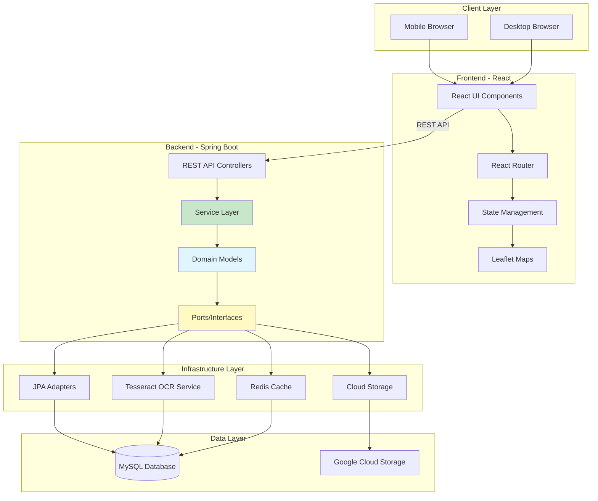
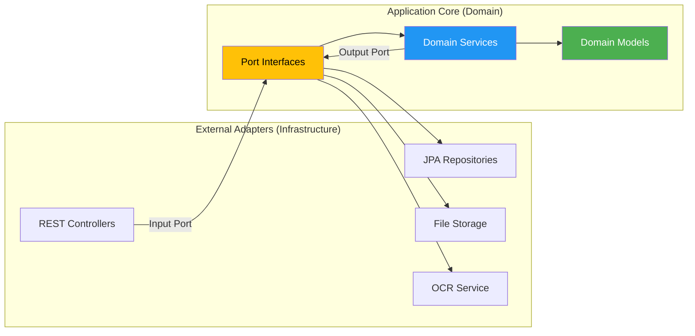
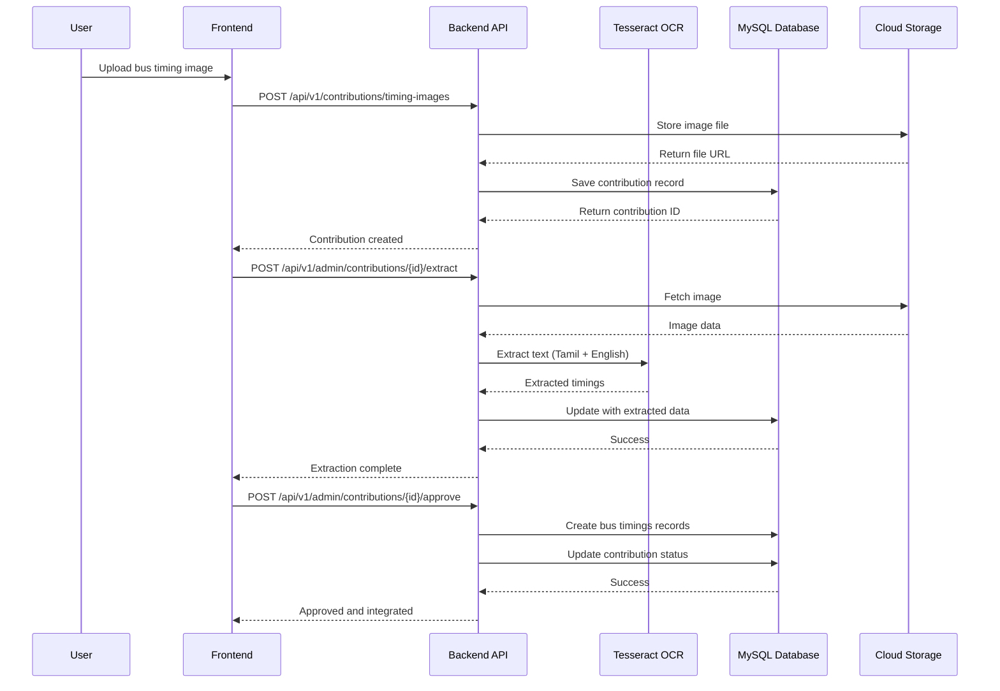
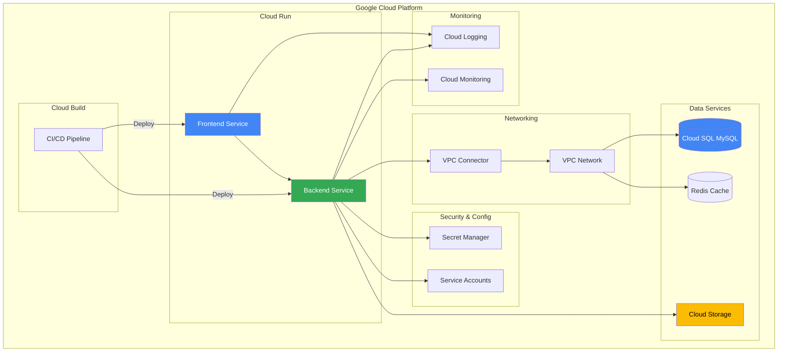

# Perundhu Bus Tracker

Real-time bus tracking and route planning application for Tamil Nadu, India.

## 📋 Table of Contents

- [Overview](#overview)
- [Quick Start](#quick-start)
- [Architecture](#architecture)
- [Deployment](#deployment)
- [Documentation](#documentation)
- [Tech Stack](#tech-stack)
- [Development](#development)

## 🎯 Overview

Perundhu is a comprehensive bus tracking and route planning application built with modern technologies, following **Hexagonal Architecture** principles for maintainability and scalability.

### Key Features
- 🚍 Real-time bus tracking with live location updates
- 🗺️ Interactive route planning with OpenStreetMap
- 📸 OCR-based bus timing image processing (Tamil + English)
- 🔍 Smart autocomplete for bus stops and routes
- 📱 Mobile-responsive design with Material UI
- 🔐 Secure OAuth2 JWT authentication
- ☁️ Cloud-native deployment on Google Cloud Platform

## 🚀 Quick Start

### Local Development

**Frontend:**
```bash
cd frontend
npm install
npm run dev  # Runs on http://localhost:5173
```

**Backend:**
```bash
cd backend
./gradlew bootRun  # Runs on http://localhost:8080
```

### Cloud Deployment

**Step 1: Deploy Infrastructure**
```bash
cd infrastructure
./deploy.sh -p YOUR_GCP_PROJECT_ID -e preprod
```

**Step 2: Deploy Applications**
```bash
gcloud builds submit --config=cloudbuild.yaml
```

📖 See [Deployment Guide](#deployment) for detailed instructions.

## 🏗️ Architecture

### System Architecture



### Hexagonal Architecture Pattern



### OCR Timing Image Processing Flow



### GCP Deployment Architecture



## 🚢 Deployment

### Prerequisites
- GCP Project with billing enabled
- `gcloud` CLI installed and authenticated
- Terraform >= 1.0 installed
- Docker installed (for local testing)

### Infrastructure Setup (One-Time)

```bash
# 1. Configure Terraform variables
cd infrastructure/terraform/environments/preprod
cp terraform.tfvars.example terraform.tfvars
# Edit terraform.tfvars with your project ID

# 2. Deploy infrastructure
cd ../..
./deploy.sh -p YOUR_PROJECT_ID -e preprod
```

This creates:
- ✅ Cloud SQL MySQL database
- ✅ VPC networking with private subnets
- ✅ Service accounts with IAM roles
- ✅ Cloud Storage buckets
- ✅ Redis cache
- ✅ Secret Manager secrets
- ✅ Monitoring & alerting

### Application Deployment (CI/CD)

```bash
# Deploy via Cloud Build
gcloud builds submit --config=cloudbuild.yaml
```

The pipeline:
- ✅ Runs tests (frontend & backend)
- ✅ Builds Docker images
- ✅ Runs security scans (OWASP, Trivy)
- ✅ Executes database migrations
- ✅ Deploys to Cloud Run
- ✅ Runs health checks

### Manual Deployment

```bash
# Build and deploy backend
cd backend
./gradlew clean build
docker build -t gcr.io/PROJECT_ID/perundhu-backend .
docker push gcr.io/PROJECT_ID/perundhu-backend
gcloud run deploy perundhu-backend --image gcr.io/PROJECT_ID/perundhu-backend

# Build and deploy frontend
cd frontend
npm run build
docker build -t gcr.io/PROJECT_ID/perundhu-frontend .
docker push gcr.io/PROJECT_ID/perundhu-frontend
gcloud run deploy perundhu-frontend --image gcr.io/PROJECT_ID/perundhu-frontend
```

## 📚 Documentation

### Core Documentation
| Document | Description |
|----------|-------------|
| [IMPLEMENTATION_GUIDE.md](./IMPLEMENTATION_GUIDE.md) | Complete implementation guide with best practices |
| [HEXAGONAL_ARCHITECTURE_GUIDELINES.md](./HEXAGONAL_ARCHITECTURE_GUIDELINES.md) | Architecture patterns and conventions |
| [QUICK_REFERENCE.md](./QUICK_REFERENCE.md) | Quick reference for common tasks |

### Deployment & DevOps
| Document | Description |
|----------|-------------|
| [CLOUDBUILD_GUIDE.md](./CLOUDBUILD_GUIDE.md) | CI/CD pipeline setup and usage |
| [infrastructure/DEPLOYMENT_GUIDE.md](./infrastructure/DEPLOYMENT_GUIDE.md) | Infrastructure deployment with Terraform |
| [infrastructure/README.md](./infrastructure/README.md) | Infrastructure architecture overview |

### Feature Documentation
| Document | Description |
|----------|-------------|
| [OCR_IMPLEMENTATION_COMPLETE.md](./OCR_IMPLEMENTATION_COMPLETE.md) | OCR timing image processing system |
| [BUS_TIMING_IMAGE_SYSTEM.md](./BUS_TIMING_IMAGE_SYSTEM.md) | Bus timing image contribution system |
| [AUTHENTICATION_SETUP.md](./AUTHENTICATION_SETUP.md) | OAuth2 JWT authentication setup |
| [TRANSIT_ROUTING_IMPLEMENTATION.md](./TRANSIT_ROUTING_IMPLEMENTATION.md) | Transit routing and navigation |
| [OPENSTREETMAP_STOP_FEATURES.md](./OPENSTREETMAP_STOP_FEATURES.md) | OpenStreetMap integration |

### Frontend Documentation
| Document | Description |
|----------|-------------|
| [MODERN_UI_GUIDE.md](./MODERN_UI_GUIDE.md) | Modern UI design patterns |
| [MOBILE_DESIGN_ENHANCEMENT.md](./MOBILE_DESIGN_ENHANCEMENT.md) | Mobile responsive design |
| [RESPONSIVE_DESIGN_COMPLETION_REPORT.md](./RESPONSIVE_DESIGN_COMPLETION_REPORT.md) | Responsive design implementation |

### Backend Documentation
| Document | Description |
|----------|-------------|
| [backend/TESSERACT_INSTALLATION.md](./backend/TESSERACT_INSTALLATION.md) | Tesseract OCR setup guide |
| [DATABASE_MIGRATION_SUCCESS.md](./DATABASE_MIGRATION_SUCCESS.md) | Database migration guide |
| [COST_OPTIMIZATION_VERIFICATION.md](./COST_OPTIMIZATION_VERIFICATION.md) | GCP cost optimization strategies |

### Testing Documentation
| Document | Description |
|----------|-------------|
| [PLAYWRIGHT_INSTALLATION_SUCCESS.md](./PLAYWRIGHT_INSTALLATION_SUCCESS.md) | E2E testing with Playwright |
| [CODE_COMPLIANCE_SUMMARY.md](./CODE_COMPLIANCE_SUMMARY.md) | Architecture compliance testing |

### GitHub Copilot
| Document | Description |
|----------|-------------|
| [COPILOT_SETUP.md](./COPILOT_SETUP.md) | GitHub Copilot configuration and prompts |

### Project Status Reports
| Document | Description |
|----------|-------------|
| [FINAL_STATUS_REPORT.md](./FINAL_STATUS_REPORT.md) | Project completion status |
| [TIMING_IMAGE_CONTROLLERS_CREATED.md](./TIMING_IMAGE_CONTROLLERS_CREATED.md) | OCR REST API controllers |

## 🛠 Tech Stack

### Frontend
- **Framework**: React 18.3 with TypeScript 5.6
- **Build Tool**: Vite 5.4
- **Routing**: React Router v6
- **UI**: Material UI + TailwindCSS
- **Maps**: Leaflet with OpenStreetMap
- **State**: React Query (TanStack Query)
- **Testing**: Vitest, React Testing Library, Playwright
- **Deployment**: Nginx on Cloud Run

### Backend
- **Language**: Java 17 LTS
- **Framework**: Spring Boot 3.4.5
- **Architecture**: Hexagonal (Ports & Adapters)
- **Data**: Spring Data JPA, Flyway migrations
- **Security**: Spring Security with OAuth2 JWT
- **Database**: MySQL 8.0
- **OCR**: Tesseract 5.7.0 (Tamil + English)
- **Build**: Gradle 7.6
- **Testing**: JUnit 5, Mockito, ArchUnit
- **Deployment**: Docker on Cloud Run

### Infrastructure
- **Cloud**: Google Cloud Platform
- **IaC**: Terraform
- **CI/CD**: Cloud Build
- **Database**: Cloud SQL MySQL
- **Storage**: Cloud Storage
- **Cache**: Redis (Memorystore)
- **Secrets**: Secret Manager
- **Networking**: VPC with private subnets
- **Monitoring**: Cloud Logging + Cloud Monitoring

## 🧪 Development

### Frontend Development

```bash
cd frontend

# Install dependencies
npm install

# Run development server
npm run dev

# Run tests
npm test

# Run tests with coverage
npm run test:coverage

# Run E2E tests
npm run test:e2e

# Type checking
npm run type-check

# Linting
npm run lint

# Build for production
npm run build
```

### Backend Development

```bash
cd backend

# Run application
./gradlew bootRun

# Run tests
./gradlew test

# Run architecture tests
./gradlew hexagonalTest

# Build application
./gradlew clean build

# Run with specific profile
./gradlew bootRun --args='--spring.profiles.active=dev'
```

### Database Migrations

```bash
cd backend

# Run migrations
./gradlew flywayMigrate

# Check migration status
./gradlew flywayInfo

# Validate migrations
./gradlew flywayValidate
```

### GitHub Copilot Integration

This project includes comprehensive GitHub Copilot configuration:

- **Custom Prompts**: `@workspace /playwright-generate-test`, `/sql-code-review`, `/java-junit`
- **Instructions**: Auto-applied patterns for TypeScript and Java files
- **Chat Modes**: `#expert-react-frontend-engineer`, `#principal-software-engineer`

See [COPILOT_SETUP.md](./COPILOT_SETUP.md) for complete details.

## 📝 Contributing

1. Follow [Hexagonal Architecture Guidelines](./HEXAGONAL_ARCHITECTURE_GUIDELINES.md)
2. Write tests for new features
3. Run architecture compliance tests: `./gradlew hexagonalTest`
4. Ensure all tests pass before committing
5. Follow the code style guides in respective documentation

## 📄 License

This project is licensed under the MIT License.

## 🤝 Support

For issues or questions:
- Check the [documentation](#documentation)
- Review [troubleshooting guides](./CLOUDBUILD_GUIDE.md#troubleshooting)
- Create an issue in the repository

---

**Built with ❤️ for Tamil Nadu's public transportation**
